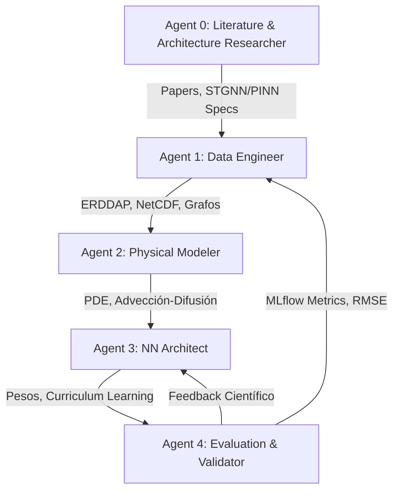

# Blueprint del Proyecto: Reconstrucción 4D de Clorofila-a en la Costa Noroccidental de Baja California
## De Perfiles Discretos a Campos Continuos del Océano

Este documento define la estructura científica, la arquitectura de agentes (roles de IA) y la suite de validación (Harness Framework) para guiar la transición de los datos descriptivos puntuales de IMECOCAL (1998-2012) a campos tridimensionales y temporales (4D) continuos de clorofila-$a$.

---

## 1. El Reto Científico y Métodos de Reconstrucción de la Literatura
Las observaciones oceanográficas in-situ proporcionan muestreos puntuales y espaciotemporalmente discontinuos:
$$D = \{ (\mathbf{x}_i, t_i, C_i) \}_{i=1}^N$$
El objetivo es reconstruir el campo continuo $C(\mathbf{x}, t)$ en todo el dominio tridimensional y el tiempo, preservando la consistencia física y biológica. 

Para lograrlo, la literatura científica actual ofrece cuatro grandes vertientes que debemos investigar exhaustivamente antes de seleccionar la arquitectura final:

1.  **Interpolación Óptima y Kriging Espaciotemporal (Línea Base)**: 
    *   Estima $C(\mathbf{x}, t)$ estadísticamente usando matrices de covarianza. Computacionalmente rápido y proporciona incertidumbre analítica, pero asume estacionariedad y es incapaz de modelar el transporte advectivo de mesoescala (ej. filamentos de surgencia).
2.  **Modelado Inverso Basado en Advección-Difusión (Data Assimilation - 4DVar)**:
    *   Acopla los datos observados directamente con modelos hidrodinámicos (e.g. ROMS) minimizando una función de costo de manera variacional. 
    *   Ofrece máxima consistencia física pero requiere conocer con absoluta precisión los tensores de difusividad y es extremadamente costoso a nivel computacional.
3.  **Redes Neuronales Informadas por la Física (PINNs)**:
    *   Aproxima el campo mediante una red neuronal profunda $\hat{C}(\mathbf{x}, t; \theta)$ cuya función de pérdida penaliza violaciones a la ecuación diferencial de advección-difusión-reacción:
        $$\mathcal{L}(\theta) = \mathcal{L}_{\text{data}}(\theta) + \lambda \mathcal{L}_{\text{physics}}(\theta)$$
    *   Al ser independientes de la malla (*mesh-free*), asimilan datos dispersos asíncronos de forma natural. Requieren el campo de velocidad 4D $\mathbf{u} = (u,v,w)$ provisto por reanálisis (ej. Copernicus Marine CMEMS vía ERDDAP).
4.  **Redes Neuronales de Grafos Espaciotemporales (STGNNs) y PI-GNNs**:
    *   El estado del arte emergente. Modelan las estaciones y las dinámicas oceánicas como un grafo dinámico, capturando teleconexiones espaciales largas que los modelos de grilla ignoran.
    *   Las recientes **Physics-Informed GNNs (PI-GNNs)** embeben las ecuaciones diferenciales en los sesgos inductivos del propio grafo, resultando excepcionales para el modelado en mallas no estructuradas (como la red irregular de lances de CTD de IMECOCAL).

---

## 2. Arquitectura de Agentes de IA Colaborativos
Para sistematizar la investigación y el desarrollo, estructuramos el flujo de trabajo en 5 roles agénticos. La IA adoptará estos roles dinámicamente:



### Roles Especializados:
0.  **Agent 0 (Literature Researcher): Investigación del Estado del Arte**
    *   *Objetivo:* Antes de programar, utilizar búsqueda web para minar papers recientes sobre reconstrucción espaciotemporal de clorofila y PI-GNNs/PINNs. Decidir empíricamente la arquitectura final (ej. si una STGNN superará a una PINN MLP pura).
1.  **Agent 1 (Data Engineer): Integración ERDDAP y Covariables**
    *   *Objetivo:* Aprovechar la infraestructura ERDDAP para descargar e integrar variables de forzamiento continuo: corrientes 3D ($u, v, w$) de Copernicus CMEMS, SST satelital y batimetría. Preparar el `DataLoader` y/o la topología del grafo.
2.  **Agent 2 (Physical Modeler): Codificación de las PDE**
    *   *Objetivo:* Traducir las ecuaciones de transporte a operadores diferenciales (vía PyTorch Autograd o Message Passing en grafos).
3.  **Agent 3 (NN Architect): Estrategia de IA y Curriculum Learning**
    *   *Objetivo:* Diseñar e implementar la red seleccionada por el Agent 0. Aplicar **Curriculum Learning**: entrenar primero con $\lambda=0$ (solo datos), encender luego la difusión, y finalmente acoplar la advección 4D.
4.  **Agent 4 (Validator): Evaluación y MLflow**
    *   *Objetivo:* Ejecutar validación cruzada estructurada, registrar ejecuciones en **MLflow**, y generar mapas científicos.

---

## 3. Estructura del Framework (Harness)
Para asegurar el rigor científico del proyecto, implementaremos una suite de validación profesional:

```text
pinn_coastal_model/
├── data/                       # Almacenamiento local (IMECOCAL, CMEMS via ERDDAP)
├── src/
│   ├── data_ingestion/         # Conectores ERDDAP y preprocesamiento de grafos
│   ├── physics/                # Operadores diferenciales (PyTorch)
│   └── models/                 # Arquitecturas neuronales (PINN / STGNN)
├── tests/
│   └── test_harness.py         # Test Harness (Matemáticas y PDE)
├── evaluation/
│   └── evaluation_harness.py   # Evaluation Harness (Métricas estandarizadas)
└── experiments/
    └── experiment_harness.py   # Experiment Harness (MLflow y Curriculum Learning)
```

### 3.1. Test Harness (Verificación Matemática Local)
Garantiza que la física no tenga errores de programación antes de lanzar entrenamientos:
*   *Unit Tests de Derivadas:* Verificar que las derivadas espaciales sobre tensores sintéticos sean matemáticamente exactas.
*   *Test de Advección:* Comprobar que una pluma gausiana sintética se desplaza correctamente bajo el campo de velocidad $\mathbf{u}$.

### 3.2. Evaluation Harness (Rigor Estadístico Espaciotemporal)
Evita el sobreajuste y garantiza generalización:
*   *Validación Cruzada Espacial:* Omitir estaciones completas o transectos enteros (ej. toda la Línea 100). Evaluar el RMSE en estas zonas "ciegas".
*   *Validación Cruzada Temporal:* Omitir periodos clave (ej. evaluar generalización en un evento de El Niño extremo).

### 3.3. Experiment Harness (Gestión Sistemática con MLflow)
Automatiza la experimentación científica y el rastreo de resultados:
*   *Integración MLflow:* Registro automático de hiperparámetros y artefactos.
*   *Curriculum Learning Sequencer:* Aumenta gradualmente el peso de la pérdida física a medida que el modelo se ajusta a los datos reales.

---

## 4. Plan de Acción Científica Inmediato
1.  **Fase 0: Investigación Arquitectónica (Agent 0)**
    *   Realizar una búsqueda profunda en la literatura para evaluar PINNs vs STGNNs aplicados a oceanografía mesh-free.
    *   Seleccionar y justificar el modelo matemático final.
2.  **Fase 1: Infraestructura de Datos (Agent 1)**
    *   Establecer la conexión con **ERDDAP** para descargar perfiles de corrientes oceánicas ($u,v$) de CMEMS.
3.  **Fase 2: Baseline Model (Agent 4 & Agent 1)**
    *   Configurar MLflow y establecer Kriging como métrica a batir.
4.  **Fase 3: Desarrollo Físico y Neuronal (Agent 2 & 3)**
    *   Codificar `physics_loss.py` y el modelo neuronal seleccionado. Validarlo en el Test Harness.
5.  **Fase 4: Reconstrucción 4D Continua**
    *   Entrenar el modelo con corrientes reales y generar campos continuos del océano, trasladando los resultados al reporte final.
